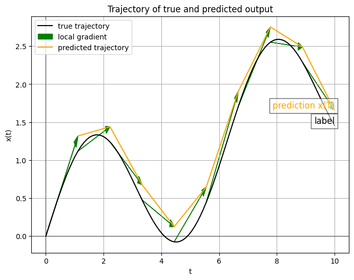
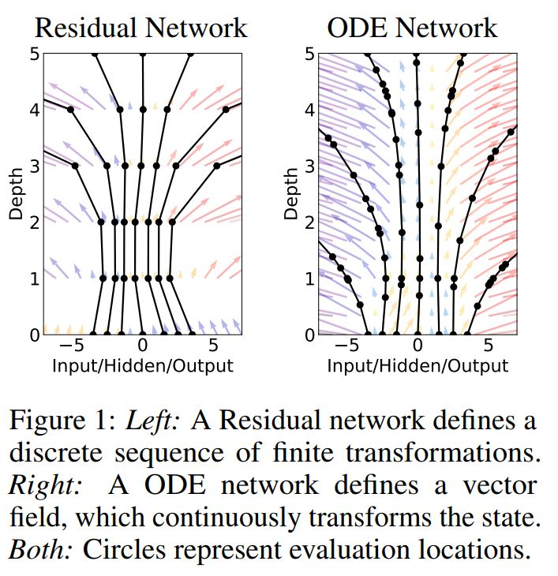
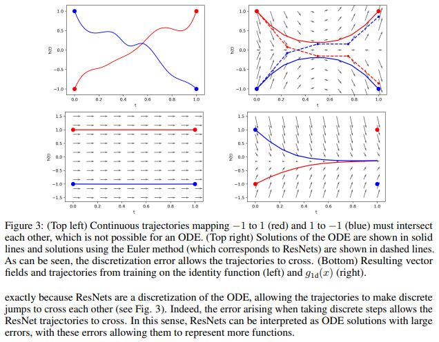

# Background
## ResNet

Resnet: $x_{t+1} = x_t + f(x_t)$

When learning the transition from one input to the direct next output, it is simpler to focus on the difference between the two. This approach ensures that the gradient 
$\frac{dx_{t+1}}{dx_t} = 1 + \frac{df}{dx_t}$ which effectively prevents issues related to vanishing or exploding gradients.

## From discrete to continuous domain
$t$ in the above equations represent the layer index. For example $x_{t+1}$ may be the first ResNet-Layer and $x_{t+2}$ may be the second ResNet-Layer within a bigger network.

Let's consider the layer index $t$ as continuous time.
For now, accept the abstract mathematics. The intuition will follow later.

$x_{t+1} - x_t = f(x_t)$

$\frac{x_{t+1} - x_t}{t+1 - t} = f(x_t)$ ***denominator is t+1-t = 1, thus no changes in the equation***

By imagining that $t$ represents discrete time steps instead of layer indices,
we can reduce the "time step" between two consecutive steps ($t$ and $t+1$) resulting in:

$\frac{dx(t)}{dt} = f(x)$

This is a simple ordinary differential equation. We now went from an understandable discrete hidden-layer Network to a description of a dynamic system.

How can we interpret this system now? What is the input, intermediate and final output?

# Neural Ordinary differential equation (NODE)

The general function $f$ in the above equation can be now represented by a parameterized neural network.
For instance, a simple fully-connected layer or a 2D convoluational layer with subsequent non-linear activation function can be used.

Note: In the end, we want to train the internal weights and biases analog to a conventional neural network.

The NODE can be expressed as follows:

$\frac{dx(t)}{dt} = f(x(t),t;\theta)$

Here, $\theta$ represents the internal parameter i.e., weights and biases.

## Forward-Pass

In conventional artificial neural networks, the output of the current layer is the input of the next layer.
Here, we only have one "hidden layer".
Instead of transforming the intermediate output (input) $x_t$ through different layer, defined by the architecture,
we transform $x$ by the same layer ***BUT*** along subsequent time-steps.

To understand this even better, we will take a look at one forward pass.
Define the input (e.g. RGB-image) as $x(t=0) := x_0$

Differences, now the function f can be a learnable paramterized neural layer or a combination of layers, as long as 
the input shape matches the output shape, since the output of one time step will be the input of the next time step.

One Forward-Pass computes the output (and the trajectory) by the well-known [Euler method](https://en.wikipedia.org/wiki/Euler_method).
The gradients (green arrows) can be computed, since we have the formula of $\frac{dx(t)}{t}$ at hand. 

We first compute the gradient of the initial starting point $x_0$.

The result of $f(x_0)$ guides the initial point $x_0$ to the next point of the trajectory.
By doing this for multiple time steps, where we go along the gradient in a pre-defined stepsize $h$,
we are able to obtain the whole dynamic-trajectory of the system.

$x_1 = f(x_0) \cdot h + x_0$ Computing the second point of the trajectory

We will end at at the last point $x(t=T)=x_T$.

Note: Because we go in discrete steps defined by $h$ we will have a numerical error.
I.e., for $h\rightarrow0$ the method will yield the perfect trajectory. We can define h based on our wish.

## Interpretation

Instead of learning the transformation of the input data from layer to layer, we try to learn the underlying dynamics of the transformation itself.
The weights and biases of a NODE-Layer does not only contain the transformative information, which is learned to transform the data from the current to the direct next step (such as in discrete layers),
rather it contains the information of transforming the data from every step to the next step.

Instead of stacking more and more layers on top of each other to obtain a more powerful network, a NODE contains only one "Layer" (or sub-network) and computes the output "over time".
The dynamics of the transformation, which is desired by the user, are directly learned and not approximated by a big architecture and discrete transformation steps.

The above figure from the original paper highlights the difference in data transformation. ResNets (left) try to learn the transformation (colorful vectors at each depth (y-axis)).
NODE (right) try to learn the underlying vector field itself. Hence, intermediate data can be spread in a non-uniform manner along the depth-axis, which represents the continuous time. 

## Backward-Pass
Since, the mismatch of the output, in our case the output of the model $x_T$, and the corresponding label $y$ determines the Error of our model, we can compute the total Loss.

For example, we can use a standard mean-squared error:

$loss = MSELoss(x_T, y)$

$x_T$ is defined by going along the trajectory. By $h\rightarrow0$, we obtain the integral of $f(x(t),t,\theta)$, since integrating the derivative $\frac{dx(t)}{dt}$ over time bounded by $t=0$ and $t=T$
yields $x_T - x_0$.

Hence,

$loss = L(x_0 +\int_{t_0}^{T}f(x(t)dt) ) = L(ODESolve(x_0,f,t_0,T,\theta))$

Since we already have the trajectory of $x(t)$ by computing the forward pass,
it would be possible to store all the activations in each timestep and perform backward differentiating reverse the operations of the forward pass.
But this would lead in high memory cost and in additional numerical errors.

So, we do another approach.

### Adjoint sensitivity method

At the end of our backward pass, we are interested in following gradient $\frac{dL}{d\theta}$, since we want to adapt the internal parameters.

Using the so-called adjoint sensitivity method, we utilize a mathematical trick to first transform our initial differential equation to another differential equation.

The first step is to define the following adjoint state $a(t)$:

$a(t) := \frac{dL}{dx(t)}$

One can show, that the adjoint state follows the following relationship:

$da(t)/dt = -a(t) \cdot \frac{df(x(t))}{dx}$

This relationship comes from a derivation, which is shown in appendix B.1 in the original paper.
For now, we will focus on the backward pass itself.

Moreover, one can show, that the derivative $\frac{dL}{d\theta}$ follows following realtionship:

$\frac{dL}{d\theta} = - \int_{T}^{t_0}(a(t) \cdot \frac{df(x(t))}{d\theta} \cdot dt )$

For solving this integral, we need the trajectory of $a(t)$ and trajectory of $x(t)$. Since we have a formula for both of them at hand, we can
utilize the Euler methods again, as we used at the forward pass. The difference here is that we start from our final values $x(T) := x_T$ (Note the boundaries of the integral) and
the corresponding $a(T) = \frac{dL}{x_T}$, which we have given after the forward-pass as the end of the predicted trajectory.

So, by starting drawing our trajectory at time step T and computing the derivatives for a(t) and x(t) (since we have the diff.eq. at hand)
we can compute our final derivative $\frac{dL}{d\theta}$ and utilize the latter to update the internal parameters $\theta$.

## Advantages

The memory cost of our NODE is constant, i.e., $O(1)$, since we do not need to store our intermediate activation for the backward pass.
The backward pass is able to reconstruct the trajectory itself.

Euler`s method is only one type of ODE Solvers, more modern solvers are able to solve ODEs more efficiently and accurately and have the ability
for the user to guarantee maximum growth of the approximation error.

Based on the precision of the ODESolver (which may be defined by the user based on the available resources), the cost of evaluating the NODE model
is proportional to the initial complexity.
Quote from [Chen et al.](https://arxiv.org/abs/1806.07366):
_"After training, accuracy can be reduced for real-time or low-power applications."_

# Augmented neural ODE

First, we take a look at a simple mapping problem, which we want to solve with an NODE:
Imagine our input consists of one-dimensional scalar values, consisting of either -1 or 1.
This input value should now be mapped to the corresponding labels (1 (for input=-1) and -1 (for input=1))

We can visualize this problem with the following figure from [this paper](https://arxiv.org/abs/1904.01681):

Imagine the input points (red and blue point at the left-hand side) should be transformed along a defined vector space in time to the output points
(right-hand side).

Intuitively, we can understand, that this is not possible with a standard NODE, since there is no possibility to define a 2D-vector space
in which the two desired trajectories can cross. Note: The mathematical proof of this is in the paper, but let's not bother with this.

To tackle this issue, Dupont et al. introduced augmented neural ODE. The main idea here is to insert additional dimensions to the input, such that
the network can find a vector space, in which the desired trajectories are not forced to merge.

For exmaple, a 3D-vector space can be learned such that the mapping is achieved without the two trajectories crossing.

### Why is a simple ResNet able to compute this mapping?

A ResNet does not learn the underlying dynamis of the transfomration system, it learns every discrete step one by one.
Hence, the ResNet is able to insert some form of dersired error in the right step of the trajectories, such that the two trajectories are able
to cross in the transformation space.

