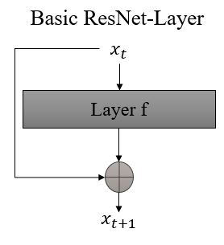

# Background

Resnet: $x_{t+1} = x_t + f(x_t)$

When learning the transition from one input to the direct next output, it is simpler to focus on the difference between the two. This approach ensures that the gradient 
$\frac{dx_{t+1}}{dx_t} = 1 + \frac{df}{dx_t}$ which effectively prevents issues related to vanishing or exploding gradients.

Let's consider the layer index $t$ as continuous time.
For now, let's focus on the abstract mathematics. The intuition will follow later.

$x_{t+1} - x_t = f(x_t)$

$\frac{x_{t+1} - x_t}{t+1 - t} = f(x_t)$ *** denominator is $t+1-t = 1$, thus no changes in the equation ***

By imagining that $t$ represents discrete time steps instead of layer indices,
we can reduce the "time step" between two consecutive steps ($t$ and $t+1$) resulting in:

$dx(t)/t = f(x)$

This is a simple ordinary differential equation. 

Differences, now the function f can be a learnable paramterized neural layer or a combination of layers, as long as 
the input shape matches the output shape, since the output of one time step will be the input of the next time step.
See this later.

What is now one forward pass of this function?

The input is defined at the initial time step t_0 i.e., input = x(t_0) := x_0

This reduces the problem to a intial value problem.

At first we are interested in the output of the network, ie.e the trajectory of the x(t).

We can do this with the well-known Euler method:

We first compute the gradient of the initial starting piuint x_0.
this is easy, since we have the formula of the gradient dx(t)/t already at hand:

The result of f(x_0) guids the initial ppoint to the next point of the trajectroty.

x_1 = f(x_0)*h + x_0

Here h is the step size in time. Note: because we go in discrete steps defined by h we will have a numerical error
. I.e., for h-->0 the method will yield the perfect trajectory. We can define h based on our wish.

Since, the output in our case the output of the model y_T (here T is the last time step of our trajectory)
and the corresponding label determines the Loss of our model. For exmaple we can use MSELoss,
loss = MSELoss(y_T)

y_T is defined by going along the trajoctroy or in our case integrating the derivaive dx(t)/t along the time steps, i.e.,

loss = L(z_0 + integrate_t0_T_(f(x(t)dt)) ) = L(ODESolve(x_0,f,t0,t1,theta)) # more general form

# Backward

It would be possible to store all the activations in each timestep and perfrom backward differentiating reverse the operations of the forward pass.
But this would lead in high memory cost and in additional numerical errors.

So, we do another approach.

At the end of our backward pass, we are interested in following gradient dL/dtheta, since we want to adapt the internal parameters.

Using the so-called adjoint sensitivity method, we utilize a mathematical trick to first transform our initial diff.eq. to another diff.eq.

The first step is to define the following adjoint state a(t):

a(t) := dL/dx(t)

One can show, that the adjoint state foloows the following relationship:

da(t)/dt = -a(t)* (df(x(t))) / (dx)

This relationship comes from a derivation, which is shown in appendix B.1 in the original paper. We will look at it later...

Moreover, one can show, that the derivative dL/dtheta follows follwoing realtionship:

dL/dtheta = - integrate(a(t)* (df(x(t))) / (dtheta) * dt )

For solving this integral, we need the trajectory of a(t) and trajectory of x(t). Since we have a formula for both of them at hand, we can
utilize the Euler methods again, as we used at the forward pass. The difference here is that we start from our final falues x(T) := x_T and
the corresponding a(T) = dL/x_T, which we have given after the forward-pass.

So, by starting drawing our trajectory at time step T and computing the derivatives for a(t) and x(t) (since we have the diff.eq. at hand)
we can compute our final derivative dL/dtheta and utilize the latter to update the internal parameters theta.

Intuition:

An ode-network, does not learn the transformation of each layer index to its next per se, rather it learns the underlying dynamics of the system.
If we take a look at the following images, which was given in the original paper:

Here the input is shown at the x-axis for y=0. The transformed input of each layer (black points) for each layer (y axis "depth of network")
is transformed by the layer at index denoted at the y-axis. By defining an ode network, which can be regarded as a continuous layer Resnet,
the set of parameters in an ODENet is able to learn the underlying gradient field, which drives the input (in case of a learn network) to its
desired output. Since, we define our step size, we can take arbitrliy step along the trajectory.

Advantages:

The memory cost of our neural ODe is constant, i.e., O(1), since we do not need to store our intermediate activation for the backward pass.
The backward pass is able to reconstruct the trajectorty itself.

Euler`s method is only one type of ODe Solvers, more modern solvers are able to solve ODEs more efficient and accurate and has the ability
for the user to guarantee maximum growth of the approximation error.
Based on the precision of the ODeSolver (which may be defined by the user based on the available resources), the cost evaluating the odemodel
is proportional to the intial complexity.
from paper:
"After training, accuracy can be reduced for real-time or low-power applications."

# Augmented neural ODE

First, we take a look at a simple mapping problem, which we want to solve with and neural ODE.
Imagine our input are in scalar value, consisting of either -1 or 1.
This input value should now be mapped to the corresponding labels (1 (for input=-1) and -1 (for input=1))

We can visualize this problem with following figure:

#insert image#

Imagine the input points (two points at the left-hand side) should be transformed along a defines vector space in time to the output points
(right-hand side)

Intuitively, we can understand, that this is not possible with a standard neuralODE, since there is no possibility to define a 2D-vector space
in which the two derired trajectories can cross.

One approach, Dupont et al., introduced augmented neural ODE. The main idea here is to insert additional dimesions to the input, such that
the network is able to find a vector space, in which the desried trajectories are not forced to merge.

Why is a simple ResNet able to compute this mapping?

A ResNet does not learn the underlying dynamis of the transfomration system, it learns every discrete step one by one.
Hence, the ResNet is able to insert some form of dersired error in the right step of the trajectories, such that the two trajectories are able
to cross in the transformation space.

